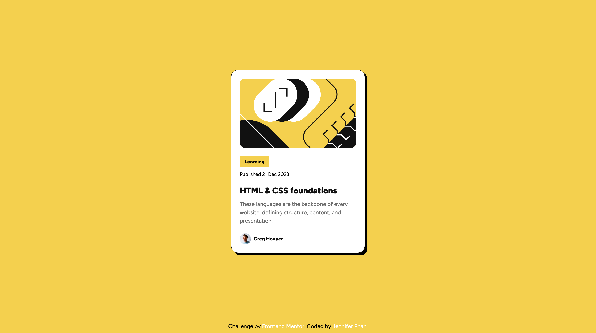

# Frontend Mentor - Blog preview card solution

This is a solution to the [Blog preview card challenge on Frontend Mentor](https://www.frontendmentor.io/challenges/blog-preview-card-ckPaj01IcS). Frontend Mentor challenges help you improve your coding skills by building realistic projects. 

## Table of contents

- [Overview](#overview)
  - [The challenge](#the-challenge)
  - [Screenshot](#screenshot)
  - [Links](#links)
- [My process](#my-process)
  - [Built with](#built-with)
  - [What I learned](#what-i-learned)
  - [Continued development](#continued-development)
- [Author](#author)

## Overview

### The challenge

Users should be able to:

- See hover and focus states for all interactive elements on the page

### Screenshot



### Links

- Solution URL: [Solution](https://www.frontendmentor.io/challenges/blog-preview-card-ckPaj01IcS)
- Live Site URL: [Live Site](https://jenphan.github.io/Blog-Preview-Card/)

## My process

### Built with

- Semantic HTML5
- CSS custom properties
- Flexbox
- Mobile-first workflow

### What I learned

This project helped reinforce some key concepts when it comes to CSS transitions and hover states. I was able to write cleaner code.

```css
.card:hover {
    box-shadow: var(--shadow-hover);
}

.card:hover .card__title {
    color: var(--clr-yellow);
}
```

### Continued development

I would like to continue using more efficient and less redundant methods when it comes to CSS margin/padding, font sizes, variables, etc.


## Author

- Github - [@github](https://www.github.com/jenphan)
- Frontend Mentor - [@jenphan](https://www.frontendmentor.io/profile/jenphan)
